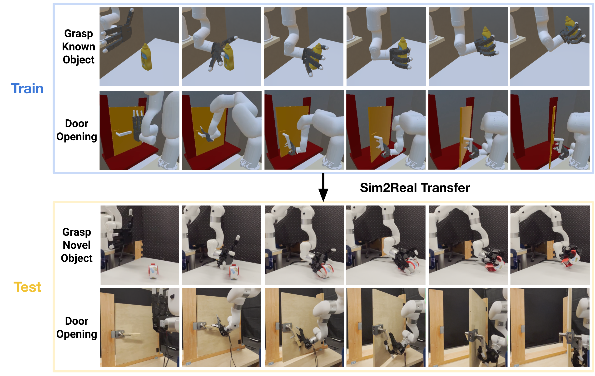

# DexPoint: Generalizable Point Cloud Reinforcement Learning for

Sim-to-Real Dexterous Manipulation with Point Cloud Input

[[Project Page]](https://yzqin.github.io/dexpoint/) [[Paper]](https://arxiv.org/abs/2211.09423) [[Poster]](https://docs.google.com/presentation/d/1dDtAPQ49k1emhETRPAib5R0wCGdwlz5l/edit?usp=sharing&ouid=108317450590466198031&rtpof=true&sd=true)
-----

[DexPoint: Generalizable Point Cloud Reinforcement Learning for
Sim-to-Real Dexterous Manipulation ](https://yzqin.github.io/dexpoint/)

Yuzhe Qin*, Binghao Huang*, Zhao-Heng Yin, Hao Su, Xiaolong Wang, CoRL 2022.

DexPoint is a novel system and algorithm for RL from point cloud. This repo contains the simulated environment and
training code for DexPoint.



## Bibtex

```
@article{dexpoint,
  title          = {DexPoint: Generalizable Point Cloud Reinforcement Learning for Sim-to-Real Dexterous Manipulation },
  author         = {Qin, Yuzhe and Huang, Binghao and Yin, Zhao-Heng and Su, Hao and Wang, Xiaolong},
  journal        = {Conference on Robot Learning (CoRL)},
  year           = {2022},
}
```

## Installation

```shell
git clone git@github.com:yzqin/dexpoint-release.git
cd dexart-release
conda create --name dexpoint python=3.8
conda activate dexpoint
pip install -e .
```

Download data file for the scene
from [Google Drive Link](https://drive.google.com/file/d/1Xe3jgcIUZm_8yaFUsHnO7WJWr8cV41fE/view?usp=sharing).
Place the `day.ktx` at `assets/misc/ktx/day.ktx`.

```shell
pip install gdown
gdown https://drive.google.com/uc?id=1Xe3jgcIUZm_8yaFUsHnO7WJWr8cV41fE
```

## File Structure

- `dexpoint`: main content for the environment, utils, and other staff needs for RL training.
- `assets`: robot and object models, and other static files
- `example`: entry files to learn how to use the DexPoint environment
- `docker`: dockerfile that can create container to be used for headless training on server

## Quick Start

### Use DexPoint environment and extend it for your project

Run and explore the comments in the file below provided to familiarize yourself with the basic architecture of the
DexPoint environment. Check the printed messages to understand the observation, action, camera, and speed for these
environments.

- [state_only_env.py](example/example_use_state_only_env.py): minimal state only environment
- [example_use_pc_env.py](example/example_use_pc_env.py): minimal point cloud environment
- [example_use_imagination_env.py](example/example_use_imagination_env.py): point cloud environment with imagined point
  proposed
  in DexPoint
- [example_use_multi_camera_visual_env.py](example/example_use_multi_camera_visual_env.py): environment with multiple
  different visual modalities, including depth, rgb, segmentation. We provide it for your reference, although it is not
  used in DexPoint

The environment we used in the training of DexPoint paper can be found here
in [example_dexpoint_grasping.py](example/example_dexpoint_grasping.py).

## Acknowledgements

We would like to thank the following people for making this project possible:

- [Tongzhou Mu](https://cseweb.ucsd.edu//~t3mu/) and [Ruihan Yang](https://rchalyang.github.io/) for helpful discussion
  and feedback.
- [Fanbo Xiang](https://www.fbxiang.com/) for invaluable help on rendering.

### Example extension of DexPoint environment framework in other project

[DexArt: Benchmarking Generalizable Dexterous Manipulation with Articulated Objects (CVPR 2023)](https://github.com/Kami-code/dexart-release):
extend DexPoint to articulated object manipulation.

[From One Hand to Multiple Hands: Imitation Learning for Dexterous Manipulation from Single-Camera Teleoperation (RA-L 2022)](https://yzqin.github.io/dex-teleop-imitation/):
use teleoperation for data collection in DexPoint environment.


